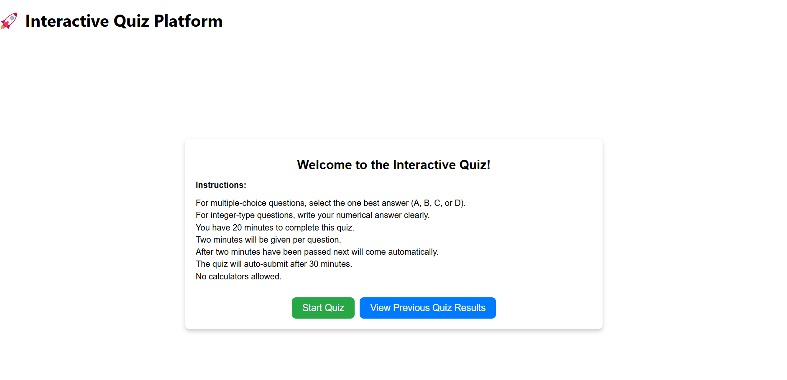
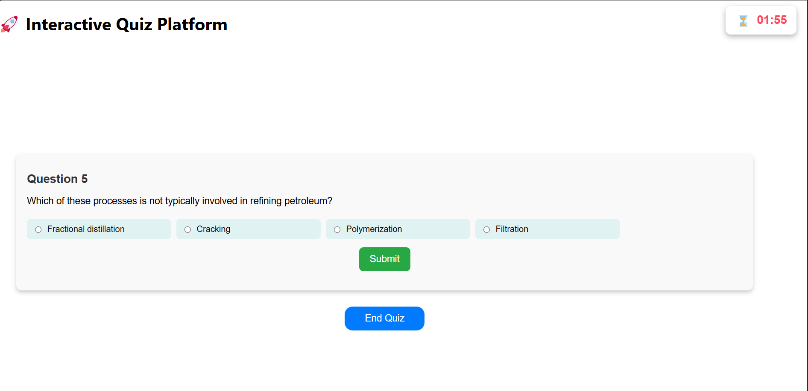
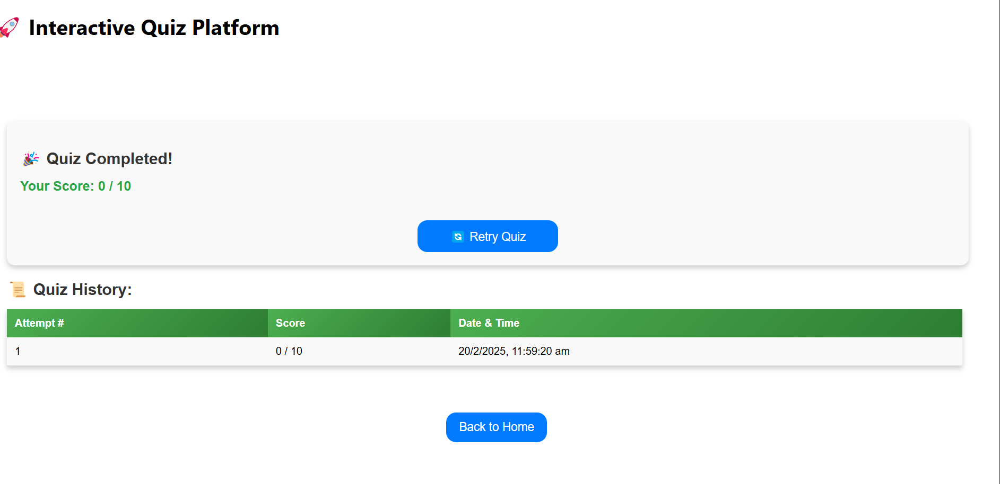

# Quiz App

A dynamic and interactive quiz application that allows users to test their knowledge on various topics. The app provides a seamless experience with real-time scoring and quiz history tracking.

## Features

### 📝  Quiz Features

- The quiz contains both Multiple Choice Questions(MCQs) and Integer type questions
- Each question has a timer to encourage quick thinking(2 mins per question).
- Read all instructions properly before starting quiz.

### 📊 Real-time Feedback

- Users can get instant feedback regarding the question they have submitted.
- Correct and incorrect answers are highlighted.

### 📜 Quiz History

- Tracks previous quiz attempts, displaying scores.
- Users can revisit their past attempts to analyze their performance.

### 📱 Responsive Design

- Works across various devices, including desktops, tablets, and smartphones.

## Demo

Here are some screenshots of the app in action:

| Home Page                                      | Quiz Page                                      | Attempt History Page                                      |
| ------------------------------------------------ | ------------------------------------------------- | --------------------------------------------------- |
|          |        |        |


## Getting Started

### Prerequisites

Ensure you have **Node.js** and **npm** (or **yarn**) installed on your system.

### Clone the Repository

```bash
git clone https://github.com/Sama2911arth/Quiz-App.git
cd Quiz-App
```

### Install Dependencies

```bash
npm install  # or yarn install
```

### Run the App Locally

```bash
npm start  # or yarn start
```

This will start the development server and open the app in your browser at [http://localhost:3000](http://localhost:3000).

### Build for Production

```bash
npm run build  # or yarn build
```

This generates an optimized production-ready version in the `build/` directory.

## Deployment

The app is live at: [Deployed Link](#) *(Replace with actual URL)*

## Contributing

Feel free to fork the repository and contribute enhancements.

##


